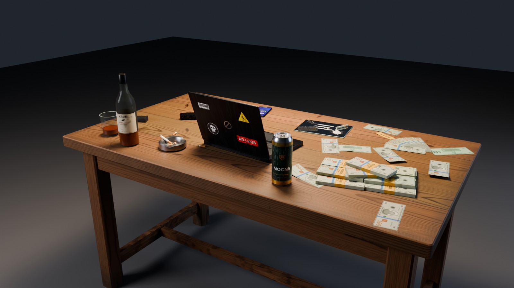
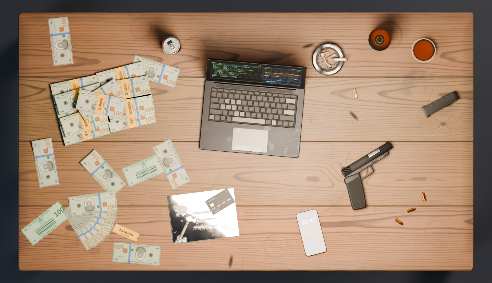
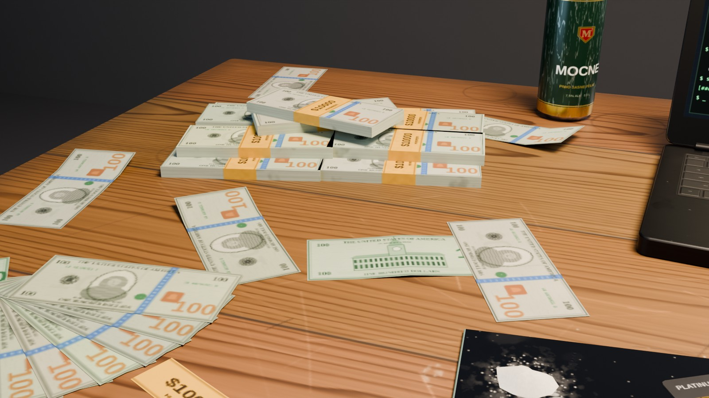
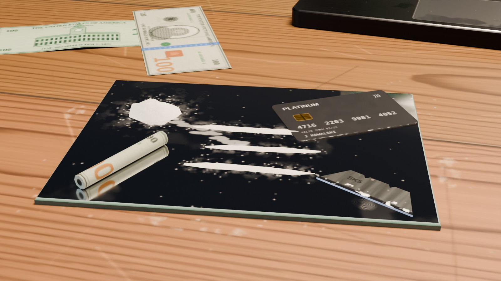
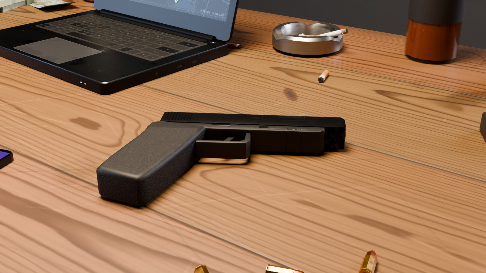
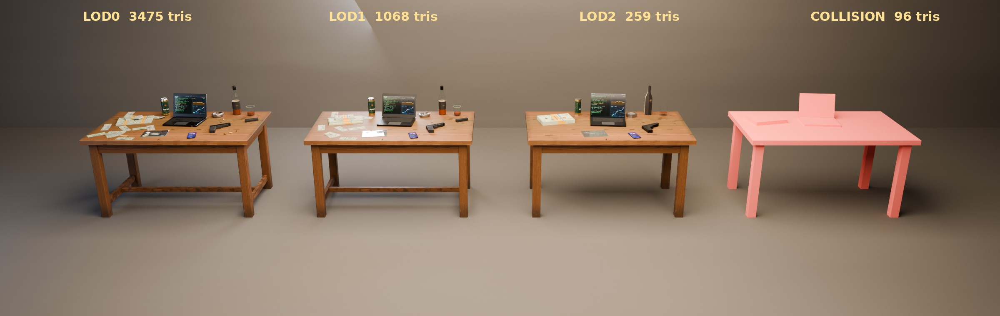
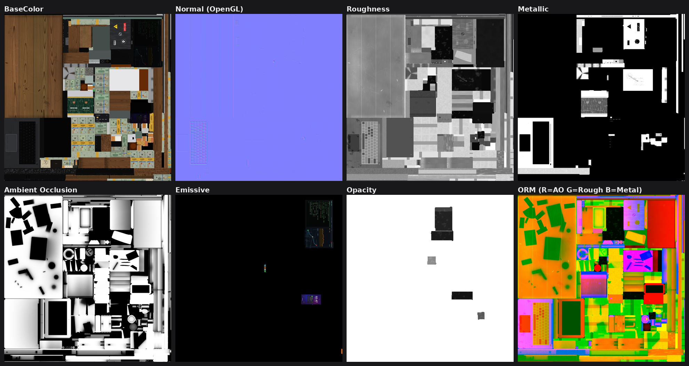
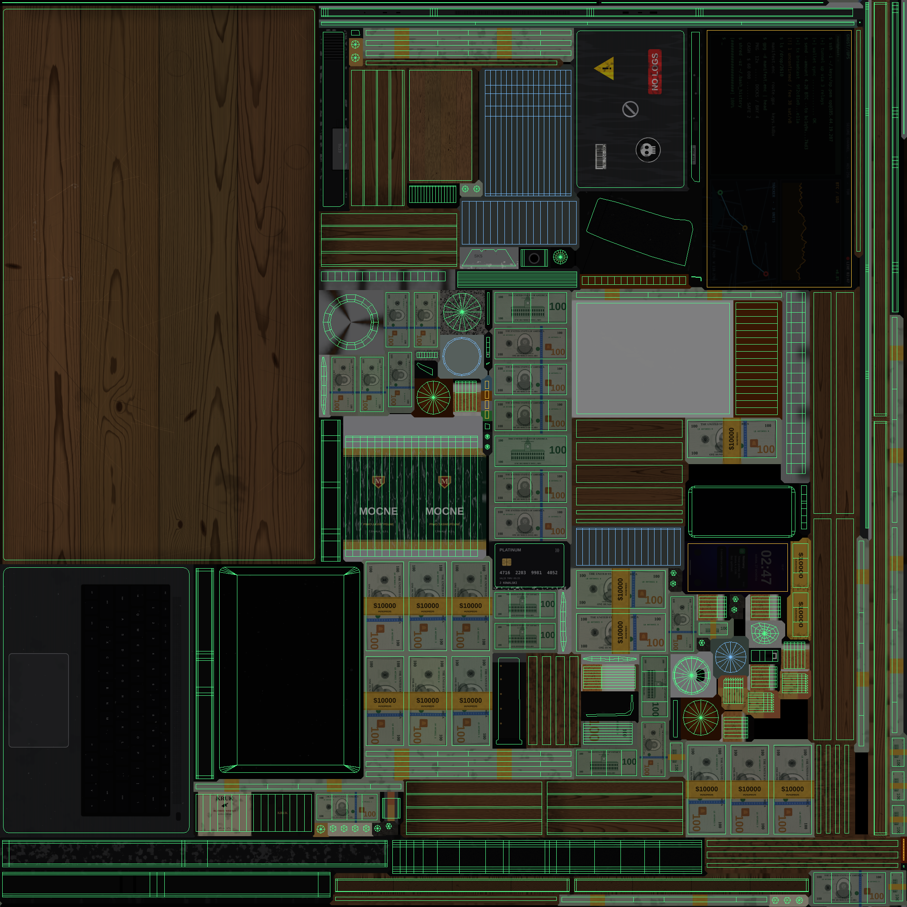

# pulse_crime_table — „kryminalny stół” (prop FiveM / GTA V)

Drewniany stół roboczy ze sceną ze świata przestępczego, przygotowany jako prop do konwersji na `.ydr`.
Całość (geometria, UV, tekstury PBR, LOD-y, kolizja, eksport) jest generowana skryptem z katalogu
[`source/`](source/), więc model można w każdej chwili odtworzyć lub zmodyfikować.


| | |
|---|---|
|  |  |
|  |  |
|  |  |

## Co jest na stole

| Miejsce | Obiekty |
|---|---|
| środek | otwarty laptop: ekran z UI (emissive), podświetlone diody (zasilanie, ładowanie, przycisk, kamerka), naklejki na klapie |
| prawa strona | pistolet 9 mm z polimerową ramą (generyczny, bez oznaczeń producenta), zapasowy magazynek, 3 naboje |
| lewa strona | stos 12 banknotów $100 w banderolach (3 warstwy), rozerwana wiązka rozłożona w wachlarz, 8 luźnych, częściowo zawiniętych banknotów, urwana banderola |
| przód | lusterko z 3 stylizowanymi kreskami białego proszku i kopczykiem, karta płatnicza (fikcyjna), żyletka, zwinięty banknot |
| tył | stalowa popielniczka z 4 petami i tlącym się papierosem (żar emissive), 2 pety na blacie, puszka 0,5 l, szklanka z resztką whisky, butelka whisky |
| prawy przód | telefon z włączonym ekranem blokady (powiadomienie) |

Blat: 4 deski z widocznymi słojami, sęki, zarysowania, nacięcia nożem, obrączki po szklankach, plamy,
przypalenia od papierosa, resztki proszku i popiołu, przetarcia lakieru i brud przy krawędziach.

Wszystkie napisy, marki i wzory są fikcyjne/stylizowane (banknoty nie są kopią prawdziwego wzoru, „MOCNE”, „KRUK”, karta bez wydawcy).

## Zawartość katalogu

```
models/pulse_crime_table/
├── fbx/
│   ├── pulse_crime_table.fbx          # LOD0 + LOD1 + LOD2 + kolizja w jednym pliku
│   ├── pulse_crime_table_lod0.fbx     # High
│   ├── pulse_crime_table_lod1.fbx     # Medium
│   ├── pulse_crime_table_lod2.fbx     # Low
│   └── pulse_crime_table_col.fbx      # siatka kolizji
├── blend/pulse_crime_table.blend      # scena źródłowa: kolekcje LOD0 / LOD1 / LOD2 / COLLISION / PREVIEW
├── textures/
│   ├── pbr/                           # zestaw PBR 2048×2048 (atlas)
│   └── gta/                           # zestaw pomocniczy GTA V: _d, _n, _s
├── gta/pulse_crime_table.ytyp.xml     # archetyp w formacie CodeWalker XML
├── preview/                           # rendery, układ UV, arkusz tekstur, validation.json
└── source/                            # generator (Python + Blender jako moduł bpy)
```

## Specyfikacja

| | LOD0 (High) | LOD1 (Medium) | LOD2 (Low) | Kolizja |
|---|---:|---:|---:|---:|
| trójkąty | **3 475** | **1 068** | **259** | 96 |
| limit | 10 000 | 5 000 | 1 000 | — |
| wierzchołki | 2 166 | 771 | 220 | 64 |

- **LOD0** – każdy obiekt modelowany osobno, zaokrąglone krawędzie broni, fazowania laptopa/telefonu/blatu.
- **LOD1** – stół jak w LOD0, mniej segmentów w bryłach obrotowych, bez faz na drobnych obiektach, 12 wiązek
  banknotów połączonych w 3 bryły, uproszczona broń, usunięte naboje, pety na blacie, żyletka, zwinięty banknot,
  urwana banderola i diody, mniej luźnych banknotów.
- **LOD2** – stół bez dolnych poprzeczek i fazowań, sylwetki: laptop, 1 bryła pieniędzy, płaski pistolet, puszka,
  szklanka, butelka, popielniczka, telefon, lusterko.
- **Wymiary**: blat 1,50 × 0,85 m, wysokość 0,78 m, najwyższy punkt (butelka) 1,065 m.
- **Pivot / origin**: `(0, 0, 0)` = środek stołu na poziomie podłogi. Transformacje wyzerowane
  (location 0, rotation 0, scale 1), więc prop stawia się prosto przez object placer / `PlaceObjectOnGroundProperly`.
- **Osie i jednostki**: Z w górę, metry (FBX: `UpAxis = Z`, `UnitScaleFactor = 100` → 1 jednostka = 1 m).
  Przód stołu (miejsce „operatora”, ekran laptopa) patrzy w **−Y**; broń po jego prawej (+X), pieniądze po lewej (−X).
- **FBX**: binarny 7.4, same trójkąty, normalne + grupy wygładzania, tangenty, biały kanał kolorów wierzchołków,
  1 kanał UV (`UVMap`), materiały z względnymi ścieżkami do `../textures/pbr/`.

### Materiały (3 sloty, jeden wspólny atlas 2048×2048)

| Slot | Zawartość | Sugerowany shader GTA V |
|---|---|---|
| `pulse_crime_table_main` | ~90 % trójkątów LOD0: stół, obudowy, broń, pieniądze, popielniczka, puszka, płyn whisky, etykieta… | `normal_spec.sps` |
| `pulse_crime_table_emissive` | ekran laptopa, ekran telefonu, diody LED, żar papierosa (28 trójkątów) | `emissive.sps` / `emissivenight.sps` |
| `pulse_crime_table_glass` | ścianki szklanki i butelki (~10 %) | shader szkła z alfą (rodzina `glass_*`) |

W GTA V jedna geometria = jeden shader, a świecący ekran i przezroczyste szkło wymagają innych shaderów niż
reszta. Dlatego są 3 sloty, ale wszystkie korzystają z **tego samego zestawu tekstur**, więc koszt pamięci to
jeden atlas. Jeśli chcesz ściśle 2 materiały: przypisz slot `glass` do `main`. Szkło zostanie wtedy nieprzezroczyste,
bo płyn i etykieta są osobną, nieprzezroczystą geometrią.

### Tekstury (`textures/`)

| Plik | Opis | Przestrzeń |
|---|---|---|
| `pbr/…_basecolor.png` | albedo (bez AO) | sRGB |
| `pbr/…_normal_gl.png` | normal map tangent-space, OpenGL (Y+) – Blender, Unity | Non-Color |
| `pbr/…_normal_dx.png` | normal map tangent-space, DirectX (Y−) – GTA V, Unreal, 3ds Max | Non-Color |
| `pbr/…_roughness.png` / `…_metallic.png` | roughness / metallic | Non-Color |
| `pbr/…_ao.png` | ambient occlusion wypalone w Cycles (96 spp) | Non-Color |
| `pbr/…_orm.png` | spakowane R = AO, G = Roughness, B = Metallic | Non-Color |
| `pbr/…_emissive.png` | ekrany, diody, żar | sRGB |
| `pbr/…_opacity.png` | alfa szkła (reszta = 1) | Non-Color |
| `gta/…_d.png` | diffuse = basecolor × AO (70 %), kanał alfa = opacity (DXT5, jeśli używasz szkła) | sRGB |
| `gta/…_n.png` | normal map DirectX (= `normal_dx`) | — |
| `gta/…_s.png` | mapa spec wyliczona z roughness/metallic: R i B = intensywność, G = połysk | — |

`_s` to punkt wyjścia do przeliczenia PBR na starszy model spec z GTA V. Siłę dostrój parametrami shadera
(`specularIntensityMult`, `specularFalloffMult`). Jeśli wypukłości na normal mapie wyglądają na odwrócone,
podmień `_n` na wersję `normal_gl`.



### UV

- Jeden atlas 2048×2048 i jeden kanał UV. 184 wyspy upakowane algorytmem MaxRects (wypełnienie ~96 %).
- **Bez nakładających się wysp.** Sprawdzone rasteryzacją trójkątów, osobno dla LOD0, LOD1 i LOD2: 0 tekseli pokrytych
  dwukrotnie, wszystkie UV w zakresie 0–1.
- Margines 5 px wokół każdej wyspy (≥ 10 px między wyspami), puste piksele wypełnione dylatacją (bezpieczne mipmapy).
- Gęstość tekseli zależy od ważności elementu: blat ~8,3 px/cm, spód blatu ~1,7 px/cm, banknoty ~8–13 px/cm,
  laptop/ekran ~18–19 px/cm, broń ~22 px/cm.
- LOD1 i LOD2 korzystają z tych samych wysp co LOD0 (UV mapowane parametrycznie), więc nie potrzebują osobnych tekstur.



### Kolizja

`pulse_crime_table_col`: 8 zamkniętych, wypukłych prostopadłościanów (blat, 4 nogi, podstawa i klapa laptopa,
stos banknotów), razem 96 trójkątów, ten sam pivot co LOD-y. Drobne przedmioty celowo nie mają kolizji.

## Konwersja do FiveM (`.ydr`)

Poniżej typowy przepływ przez Blender i [Sollumz](https://github.com/Sollumz/Sollumz). Nazwy przycisków mogą się
różnić między wersjami dodatku.

1. Otwórz `blend/pulse_crime_table.blend` albo zaimportuj `fbx/pulse_crime_table.fbx`.
2. Zamień `pulse_crime_table_lod0` na Drawable (w Sollumz: konwersja zaznaczonego obiektu na Drawable).
   Siatki `_lod1` i `_lod2` przypisz jako poziomy LOD **Medium** i **Low** tego modelu.
3. Przekonwertuj materiały na shadery GTA: `main` → `normal_spec`, `emissive` → `emissive`, `glass` → shader szkła.
   Podepnij tekstury z `textures/gta/`: DiffuseSampler = `_d`, BumpSampler = `_n`, SpecSampler = `_s`
   (emissive i szkło też używają `_d`).
4. `pulse_crime_table_col` zamień na Bound Composite z geometrią kolizji i nadaj materiał kolizji, np. `WOOD_SOLID_MEDIUM`.
5. Ustaw odległości LOD, np. High 20 m, Medium 45 m, Low 90 m, i wyeksportuj `.ydr` (oraz `.ytd`, jeśli tekstury nie są osadzone).
6. `gta/pulse_crime_table.ytyp.xml` zaimportuj w CodeWalkerze i zapisz jako `.ytyp`. `bbMin`/`bbMax`/`bsRadius`
   są policzone z geometrii. `flags = 32` to typowa wartość dla statycznych propów, ale warto ją sprawdzić.
   Jeśli tekstury są osadzone w `.ydr`, pole `textureDictionary` można wyczyścić.
7. W zasobie FiveM:

```lua
fx_version 'cerulean'
game 'gta5'

files { 'stream/pulse_crime_table.ytyp' }
data_file 'DLC_ITYP_REQUEST' 'stream/pulse_crime_table.ytyp'
```

Spawn w skrypcie: `RequestModel` → `CreateObject(GetHashKey('pulse_crime_table'), x, y, z, false, false, false)` →
`PlaceObjectOnGroundProperly(obj)`.

Z 3ds Maxa (GIMS Evo) lub ZModelera: importuj `pulse_crime_table_lod*.fbx`. Plik deklaruje Z-up i metry,
więc importer nie powinien niczego obracać ani skalować.

## Regeneracja / modyfikacja

```bash
python -m venv venv && . venv/bin/activate
pip install "bpy==4.5.*" numpy pillow scipy matplotlib
python source/build.py            # geometria, atlas, tekstury, AO, FBX, .blend, rendery (~15–20 min na 4 rdzeniach CPU)
python source/validate.py         # reimport FBX + testy (budżety, UV, pivot, normalne, tekstury)
```

Przydatne opcje `build.py`: `--no-render`, `--only-render hero,top`, `--render-samples 64`,
`--rebake` (wymuś ponowne wypalenie AO).

| Moduł | Rola |
|---|---|
| `ct_scene.py` | opis sceny: wymiary, rozmieszczenie obiektów, warianty LOD, kolizja |
| `ct_geo.py` | prymitywy z parametrycznym UV: wyciąganie profilu z fazą/zaokrągleniem, bryły obrotowe, ramka ekranu |
| `ct_pack.py` | pakowanie wysp do atlasu + mapowanie UV wspólne dla wszystkich LOD |
| `ct_paint.py`, `ct_noise.py`, `ct_art.py` | proceduralne malowanie map PBR (drewno 3D, zużycie, banknoty, UI ekranów…) |
| `ct_blender.py`, `build.py` | budowa obiektów w Blenderze, wypalanie AO, materiały, eksport, rendery |
| `validate.py` | niezależna weryfikacja plików wynikowych |

## Uwagi

- „Telefon na komodzie”: komoda nie jest częścią stołu, więc telefon leży na blacie. Komodę można dorobić jako osobny prop.
- Do szklanki z whisky dodana jest butelka (352 / 112 / 42 trójkąty w LOD0 / LOD1 / LOD2). Łatwo ją usunąć w
  `ct_scene.py` (funkcja `bottle`).
- Wyniki ostatniej weryfikacji: [`preview/validation.json`](preview/validation.json).
